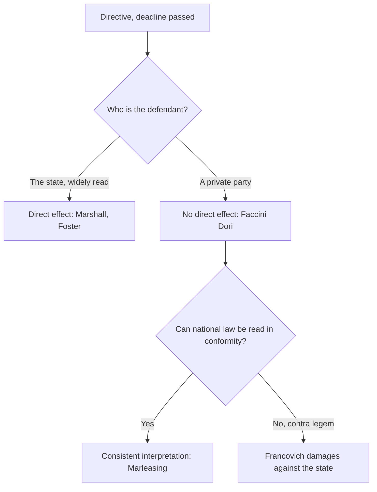

# Master notes — the internal market (Weeks 1–6)

*Fixture content. Written to exercise the renderer at length; not real coursework.*

## How to use this note

●● These are the consolidated notes for the whole goods-and-persons block. Each section opens
with the rule, then the case that gives it, then the trap the WG tutor kept catching people on.
[LECTURE]

● Where the lecture and Schütze disagree, the lecture wins — that is the standing authority order
for this course, and it decides at least three points below. [WG]

○ Anything marked ?? still needs checking against the reader before the exam.

> **Read this first.** The exam is two problem questions and one compare-and-contrast. Every
> problem question in the last four years has been a three-move structure: is it caught, can it be
> justified, is it proportionate. If you find yourself writing about anything else before you have
> answered those three, you are writing the wrong answer. [WG]

---

## 1. The constitutional frame

### 1.1 Supremacy

The rule is that Union law takes precedence over conflicting national law, whatever the rank of
that national law and whenever it was enacted. *Costa v ENEL* established it; *Internationale
Handelsgesellschaft* extended it to national constitutional law; *Simmenthal* said the national
court must disapply the conflicting provision itself, without waiting for it to be repealed or for
a constitutional court to rule. [LECTURE] [SCHUTZE]

- ●● Supremacy is a rule of **precedence**, not of validity. The national rule is not void; it is
  set aside to the extent of the conflict. Students lose marks every year by writing that the
  national measure is "annulled". [WG]
- ● *Simmenthal* is the one that matters procedurally — it is what lets an ordinary first-instance
  judge in Groningen disapply a Dutch statute. [LECTURE]
- ○ Schütze spends a long time on the German and Italian constitutional courts' counter-claims.
  Interesting, examinable only as background. [SCHUTZE]

### 1.2 Direct effect

*Van Gend en Loos*: a Treaty provision has direct effect where it is sufficiently clear, precise
and unconditional. The Court reasoned from the nature of the Union as a new legal order whose
subjects include individuals, not only states. [LECTURE]

| Instrument | Vertical direct effect | Horizontal direct effect | Authority |
| --- | --- | --- | --- |
| Treaty article | Yes, if clear and unconditional | Yes, where the provision addresses private conduct | *Van Gend*; *Defrenne* |
| Regulation | Yes | Yes | Art 288 TFEU |
| Directive, transposed | Through the national measure | Through the national measure | — |
| Directive, not transposed | Yes, after the deadline | **No** | *Marshall*; *Faccini Dori* |
| Decision | Yes, against the addressee | Limited | *Grad* |

- ●● The directive line is the examinable one. After the transposition deadline an unimplemented
  directive can be relied on **against the state**, and the state is read broadly — *Foster*
  covers bodies under state control with special powers. Against another private party, never.
  [LECTURE] [WG]
- ● The softeners: consistent interpretation (*Von Colson*, *Marleasing*) requires the national
  court to read national law in conformity so far as possible; *Francovich* liability gives
  damages against the state where the breach is sufficiently serious. [SCHUTZE]
- [!] correction from the WG: *Marleasing* does **not** require a reading that is *contra legem*.
  The slide that says "the national court must always reach the directive's result" is too strong.
  [WG]

---

## 2. Free movement of goods

### 2.1 The two regimes

●● The first move in every goods question is classification, and it is the move most often skipped.
A **charge having equivalent effect to a customs duty** falls under Arts 28–30 TFEU and is
unlawful outright: there is no justification route at all. A **measure having equivalent effect to
a quantitative restriction** falls under Art 34 and can be saved. Get this wrong and the rest of
the answer is built on sand. [WG] [LECTURE]

- ● A charge is any pecuniary charge imposed by reason of the fact that goods cross a frontier,
  however small, whatever its designation, and whoever collects it — *Commission v Italy (Statistical
  Levy)*. It does not matter that the charge is not protectionist in effect. [LECTURE]
- ● Three escapes from the charge classification, and they are narrow: the charge is payment for a
  service genuinely rendered to the importer and proportionate to it; it is an inspection fee
  required by Union law; or it is part of a general system of internal taxation, in which case it
  falls under Art 110 instead. [SCHUTZE]
- ○ *Commission v Germany (Animal Inspections)* is the standard illustration of the second escape.
  [READER]

### 2.2 Article 110 — internal taxation

Art 110(1) forbids taxing imported goods more heavily than **similar** domestic goods. Art 110(2)
forbids taxation that gives indirect protection to domestic products that are merely **in
competition** with the import. [LECTURE]

- ●● The similarity test is objective: comparable consumer use and characteristics, not identical
  products. *Commission v France (Spirits)* treated grain spirits and fruit spirits as similar.
  [LECTURE]
- ● Under 110(2) the remedy differs: the state need not equalise the tax, only remove the
  protective effect. This is a real distinction and it has been asked. [WG]
- ?? whether the reader still treats *Humblot* as a 110(2) case or as 110(1) — the lecture said
  110(2), the reader's heading says otherwise.

### 2.3 Article 34 — the catch

*Dassonville*: all trading rules enacted by Member States which are capable of hindering, directly
or indirectly, actually or potentially, intra-Union trade. [LECTURE]

> **Watch the trap.** The WG tutor pushed hard on this. Students write "Dassonville is satisfied
> because trade fell by thirty per cent". The effect on trade volume is neither necessary nor
> sufficient — the test asks about the *capability* of the rule, which is why it catches measures
> that have never actually stopped a single import. [WG]

*Cassis de Dijon* adds two things at once, and they are routinely confused:

1. **Mutual recognition.** Goods lawfully produced and marketed in one Member State must in
   principle be admitted to the others. A product-requirement rule therefore catches imports even
   when it applies equally to domestic goods, because the importer faces a double burden.
2. **Mandatory requirements.** An open, non-exhaustive list of public-interest justifications,
   available only to indistinctly applicable measures. [LECTURE] [SCHUTZE]

*Keck* then carves out **selling arrangements**: rules on when, where, how and by whom goods may be
sold fall outside Art 34 provided they apply to all relevant traders operating within the national
territory and affect the marketing of domestic products and imports in the same way, in law and in
fact. [LECTURE]

- ●● Both limbs of *Keck* must be satisfied. The "in fact" limb is what kills most attempted
  *Keck* defences: a rule that is neutral on its face but bites harder on imports — because the
  importer relies on advertising to enter the market, say — fails it. *De Agostini*. [WG]
- ● *Italian Trailers* and *Mickelsson and Roos* moved the analysis on again, to **market access**:
  a use restriction that has a considerable influence on consumer behaviour, so that demand for the
  product falls away, hinders access and is caught. [LECTURE]
- [!] correction from the WG: *Italian Trailers* is a **use** restriction, not a selling
  arrangement. The reader's discussion at p. 214 treats it as the latter and is wrong.
  [WG] [READER]

| Case | The measure | Caught by Art 34? | What it gives you |
| --- | --- | --- | --- |
| *Dassonville* | Certificate of origin for Scotch | Yes | The formula: capable of hindering |
| *Cassis de Dijon* | Minimum alcohol content | Yes | Mutual recognition; mandatory requirements |
| *Keck* | Ban on resale at a loss | No | Selling arrangements sit outside |
| *De Agostini* | Ban on advertising to children | Yes, in fact | The "in fact" limb has teeth |
| *Italian Trailers* | Ban on towing trailers | Yes | Market access beyond *Keck* |
| *Mickelsson and Roos* | Restriction on jet-ski waters | Yes | Use restrictions can foreclose access |
| *Commission v Italy (Statistical Levy)* | Levy on export statistics | Art 30, not 34 | Classification first |

### 2.4 Justification

●● The list you may use depends on the classification you made two steps ago. **Distinctly
applicable** measures — those that discriminate against imports on their face — can be saved only
by the closed list in Art 36: public morality, public policy, public security, the protection of
health and life of humans, animals or plants, national treasures possessing artistic, historic or
archaeological value, and the protection of industrial and commercial property. [LECTURE]

● **Indistinctly applicable** measures may rely on Art 36 *and* on the open list of mandatory
requirements from *Cassis*: fiscal supervision, the fairness of commercial transactions, consumer
protection, and later additions including environmental protection (*Danish Bottles*), press
diversity, and the protection of fundamental rights (*Schmidberger*). [SCHUTZE] [LECTURE]

- [!] Economic aims are **never** a justification, on either list. The slide that lists "protecting
  a domestic industry" as arguable is simply wrong and the WG tutor said so twice. [WG]
- ● Art 36's second sentence matters: the measure must not be a means of arbitrary discrimination
  or a disguised restriction on trade. This is a separate hurdle from proportionality and it is
  worth a sentence of its own in an answer. [LECTURE]
- ○ *Henn and Darby* (public morality, pornography) and *Conegate* (same ground, opposite outcome
  because the domestic position was inconsistent) are the standard pair. [READER]

### 2.5 Proportionality

Two limbs, always in this order. **Suitability**: is the measure capable of achieving the aim it
claims? **Necessity**: is there a less restrictive measure that would achieve the same level of
protection? [LECTURE]

- ●● Labelling is the standard less-restrictive alternative. If a labelling requirement would
  inform the consumer just as well, an outright ban fails necessity — that is *Cassis* itself, and
  it is the single most reusable paragraph in the whole course. [WG]
- ● The level of protection is for the Member State to choose; the Court reviews the means, not the
  chosen level. Saying "the state should simply accept more risk" is not a necessity argument.
  [LECTURE]
- ● Burden of proof sits on the Member State invoking the derogation, and it must adduce evidence,
  not assertion — *Commission v Denmark*. [SCHUTZE]

---

## 3. Free movement of persons

### 3.1 Workers

Art 45 TFEU. A worker is anyone who performs services of some economic value for and under the
direction of another, in return for remuneration — *Lawrie-Blum*. The work must be genuine and
effective, not marginal and ancillary, but part-time work below subsistence level can still
qualify (*Levin*, *Kempf*). [LECTURE]

- ●● The definition is a Union concept. A Member State cannot narrow it by domestic labour-law
  categories, and that is the point of *Lawrie-Blum* being decided on a trainee teacher. [LECTURE]
- ● *Antonissen*: a jobseeker enjoys a right of residence for a reasonable period while genuinely
  seeking work with real chances of being engaged. [SCHUTZE]
- ○ The public-service exemption in Art 45(4) is construed narrowly and functionally — it covers
  posts involving the exercise of public authority and safeguarding the general interests of the
  state, not everything in the public sector. [READER]

### 3.2 Citizenship

Arts 20–21 TFEU. *Grzelczyk*: citizenship is destined to be the fundamental status of nationals of
the Member States. *Baumbast*: Art 21 has direct effect, so residence does not depend on economic
activity. [LECTURE]

- ● *Ruiz Zambrano* is the outer edge: a measure that deprives a Union citizen of the genuine
  enjoyment of the substance of the rights attaching to the status is precluded, even in a purely
  internal situation. Later cases (*McCarthy*, *Dereci*) pulled the test back hard. [LECTURE]
- ?? whether Villanueva examines *Zambrano* at all this year — it was on the slides but not in
  the WG.

---

## 4. Getting the question to a court

### 4.1 The preliminary reference

Art 267 TFEU. Any national court or tribunal may refer a question of interpretation or validity;
a court against whose decisions there is no judicial remedy **must** refer, subject to *CILFIT*.
[LECTURE]

- ●● *CILFIT* gives three escapes from the obligation: the question is irrelevant to the outcome,
  the point has already been decided (*acte éclairé*), or the correct application is so obvious as
  to leave no scope for reasonable doubt (*acte clair*). The third is hedged with conditions that
  make it much narrower than it sounds — the national judge must be convinced the matter is equally
  obvious to the courts of the other Member States and to the Court itself, bearing in mind the
  language versions and the Union's own terminology. [LECTURE] [SCHUTZE]
- ● Validity is different from interpretation: a national court may find a Union act valid, but it
  may **not** declare it invalid. Only the Court can do that — *Foto-Frost*. This asymmetry is
  examinable and is regularly missed. [WG]
- ○ *Rheinmühlen*: a lower court's power to refer cannot be removed by a national rule binding it
  to a higher court's ruling on the point. [READER]

### 4.2 Enforcement against a Member State

Art 258 proceedings run Commission → letter of formal notice → reasoned opinion → Court. Art 260
adds the financial penalty for continued non-compliance. [LECTURE]

- ● The defences that do not work, and states keep trying them: internal difficulties, the conduct
  of another Member State, and the illegality of the measure being breached. Force majeure is
  available in principle and almost never in practice. [SCHUTZE]
- [!] correction: the reasoned opinion's deadline is the date by reference to which the breach is
  assessed, not the date of the hearing. The slide is ambiguous on this. [WG] [SLIDES]

---

## 5. The compare-and-contrast question

The third question is always structural. Recent ones have asked candidates to compare the
justification regimes across two freedoms, or the treatment of indistinctly applicable measures in
goods and services. [WG]

- ●● The marks are in the **differences**, not the similarities. Everyone writes the paragraph
  saying both use proportionality. Few write the paragraph saying that goods has a closed Treaty
  list plus a judge-made open list, while services collapses both into overriding reasons in the
  general interest. [WG]
- ● A table is a legitimate answer format here and the tutor said she likes it, provided each cell
  carries the authority. [WG]

---

## Bottom line

Classify first: Art 30 or Art 34, because one of them has no way out. Catch it with *Dassonville*,
test it against *Keck* if it is a selling arrangement, remembering that the "in fact" limb is
where most of them fail, and reach for market access if it is a use restriction. Then justify —
closed list only if the measure is distinctly applicable — and finish with suitability and
necessity, naming the less restrictive alternative. Never skip the classification step, never
argue an economic aim, and never assert proportionality without proposing the alternative.
[LECTURE] [WG]
