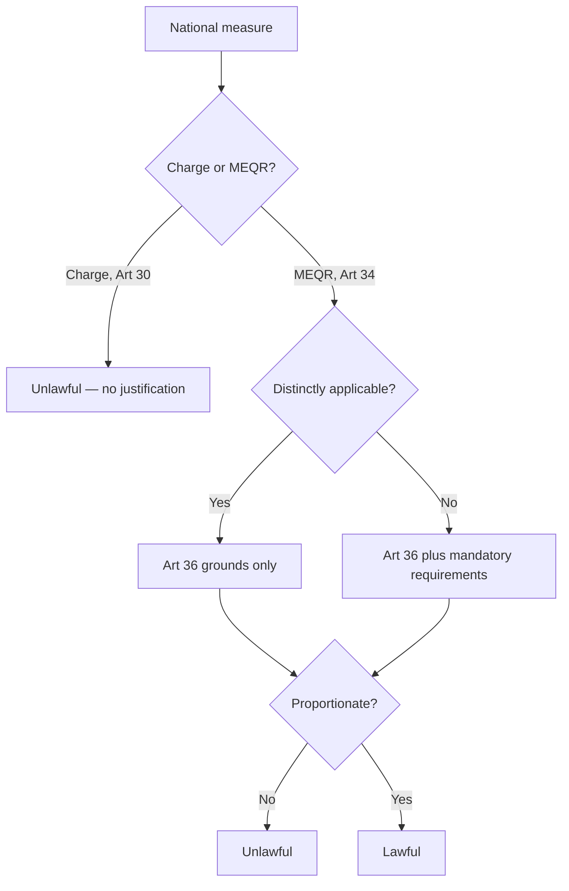

# Week 2 — Free movement of goods

*Fixture content. Not real coursework.*

## The shape of the question

- **Week 2 covers two foundational freedoms**: (1) free movement of goods under Arts 34–36 TFEU,
and (2) the customs union under Arts 28–30 TFEU. Both are asked the same way: catch, justify,
proportionality. [LECTURE]
- ●● Every goods problem starts by asking whether the measure is a **charge** (Art 30, absolute)
or a **measure having equivalent effect to a quantitative restriction** (Art 34, justifiable).
Getting this wrong loses the whole question. [WG]
- ● The distinction matters because Art 30 has **no justification route at all** — a charge is
unlawful full stop, while an Art 34 MEQR can be saved under Art 36 or by a mandatory
requirement. [LECTURE] [SCHUTZE]
- ○ Schütze puts the customs-union material first; the lecture reverses the order. Follow the
lecture for the exam. [SLIDES]

## Step one — is it caught?

*Dassonville* gives the test: all trading rules enacted by Member States which are capable of
hindering, directly or indirectly, actually or potentially, intra-Union trade. [LECTURE] The
width of that formula is the point — **capable of** hindering, not **does** hinder. [WG]

> **Watch the trap.** The WG tutor pushed hard on this: students write "Dassonville is satisfied
> because trade fell by 30%". Effect on trade volume is neither necessary nor sufficient; the
> test is about the *capability* of the rule. [WG]

*Keck* then carves out **selling arrangements**: rules about *when, where and by whom* goods may
be sold fall outside Art 34 provided they apply to all traders and affect domestic and imported
goods in the same way, in law and in fact. [LECTURE] ?? check whether Villanueva still teaches
the "in fact" limb as a separate step

| Case | Measure | Caught? | Rule it gives you |
| --- | --- | --- | --- |
| *Dassonville* | Certificate of origin for Scotch whisky | Yes | The formula: capable of hindering trade |
| *Cassis de Dijon* | Minimum alcohol content for liqueurs | Yes | Mutual recognition; mandatory requirements |
| *Keck* | Ban on resale at a loss | No | Selling arrangements fall outside Art 34 |
| *Italian Trailers* | Ban on trailers towed by motorcycles | Yes | Market access test extends past Keck |
| *Mickelsson and Roos* | Restrictions on jet-ski use | Yes | Use restrictions can hinder access |

## Step two — can it be justified?

- ●● **Distinctly applicable** measures — those that discriminate against imports on their face —
can only be saved by the closed list in Art 36: public morality, public policy, public security,
health and life of humans, animals or plants, national treasures, industrial and commercial
property. [LECTURE]
- ● **Indistinctly applicable** measures can additionally rely on the open list of mandatory
requirements from *Cassis*: fiscal supervision, public health, fairness of commercial
transactions, consumer protection — and later additions such as environmental protection
(*Danish Bottles*). [SCHUTZE]
- [!] correction from the WG: economic aims are **never** a mandatory requirement. The lecture
slide that lists "protecting a domestic industry" as arguable is wrong. [WG] [SLIDES]

## Step three — proportionality

Two limbs, always in this order: **suitability** (is the measure capable of achieving the aim?)
and **necessity** (is there a less restrictive measure that would achieve the same level of
protection?). [LECTURE] Labelling is the standard less-restrictive alternative — if a labelling
requirement would inform the consumer just as well, a ban fails. [WG]

## Bottom line

Catch it with *Dassonville*, test it against *Keck* if it is a selling arrangement, then run
Art 36 or the mandatory requirements, and finish with the two proportionality limbs. Never skip
the classification step at the top. [LECTURE]

## Live capture — lecture 4

[LEC] Villanueva opened by saying the exam will have one goods question and one
compare-and-contrast. [P] slide 6
[!] He corrected the reader: *Italian Trailers* is a **use** restriction, not a selling
arrangement. Reader says otherwise on p. 214.
?? whether the market access test replaces Keck or sits beside it
