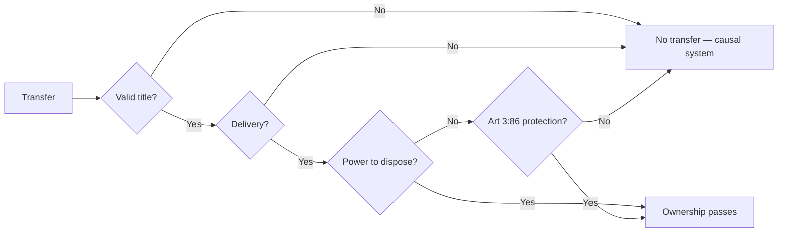

# Week 2 — Transfer of ownership

*Fixture content. Not real coursework.*

## The three requirements

●● Art 3:84 BW: transfer requires (1) a valid title, (2) delivery, and (3) the transferor's power
to dispose. All three, cumulatively. If one fails, no ownership passes. [LECTURE]

- ● Dutch law is **causal**: a defect in the title defeats the transfer, so ownership never left
  the transferor and a revindication lies. Contrast the German abstract system, where the transfer
  survives the title's failure and only an unjust-enrichment claim remains. [LECTURE] [READER]
- ● Delivery under Art 3:90 BW for movables is handing over; Arts 3:91–3:95 cover the
  substitutes. For registered property, Art 3:89 requires a notarial deed and registration.
- ○ The comparative point is worth one paragraph in the compare-and-contrast question and no
  more. [WG]

## Protection of the acquirer

Art 3:86 BW protects a good-faith acquirer for value of a movable, against the true owner, where
the transferor lacked the power to dispose. [LECTURE]

| Element | Requirement | Note |
| --- | --- | --- |
| Good faith | Art 3:11 BW | Neither knew nor ought to have known |
| For value | Consideration | A gift is not protected |
| Movable | Non-registered | Registered property has its own regime |
| Possession | Actual delivery | Constructive delivery is usually not enough |

- [!] correction from the WG: the stolen-goods exception in Art 3:86(3) runs **three years** from
  the theft, and it protects the dispossessed owner, not the acquirer. The handout has it the
  wrong way round. [WG]
- ?? whether the exception applies where the original owner was defrauded rather than robbed

> **Method.** Work the three requirements in order, in every problem. Only when power to dispose
> fails do you reach Art 3:86, and then you run its four elements one by one. [WG]

## Bottom line

Title, delivery, power to dispose. Causal system, so a bad title is fatal. Art 3:86 rescues the
good-faith purchaser for value of a movable, subject to the three-year stolen-goods window.
[LECTURE]
